# Qwen3.5 架构深度分析

> 发布时间: 2026-01-01 | 集成至 HuggingFace Transformers: 2026-02-09
> 参考模型: Qwen3.5-9B-Instruct (Dense), Qwen3.5-35B-A3B-Instruct (MoE)

## 1. 总体架构概览

Qwen3.5 是一个多模态视觉-语言模型 (VLM)，采用三层嵌套结构。

### 1.1 顶层架构图

> 图例: 平行四边形 = 数据张量, 圆角矩形 = 可学习模块, 六边形 = 无参数操作, 圆形 = 数学运算

```mermaid
graph TD
    subgraph ForConditionalGeneration["Qwen3_5ForConditionalGeneration"]
        IMG[/"Image / Video pixel_values"/] --> PE
        subgraph VIS["Qwen3_5VisionModel"]
            PE("PatchEmbed 3D Conv") --> POSEMB{{"+PosEmb + 2D RoPE"}}
            POSEMB --> VITBLK("VisionBlock x27")
            VITBLK --> MERGE("PatchMerger 2x2")
        end

        IDS[/"input_ids"/] --> EMB("embed_tokens")
        EMB --> FUSE{{"masked_scatter"}}
        MERGE --> FUSE

        subgraph TXT["Qwen3_5TextModel"]
            DL0("L0: GatedDeltaNet + MLP")
            DL1("L1: GatedDeltaNet + MLP")
            DL2("L2: GatedDeltaNet + MLP")
            DL3("L3: FullAttention + MLP")
            DLX("... x8 groups ...")
            DL31("L31: FullAttention + MLP")
            FNORM("Final RMSNorm")
            DL0 --> DL1 --> DL2 --> DL3 --> DLX --> DL31 --> FNORM
        end

        FUSE --> DL0
        FNORM --> LM("lm_head")
        LM --> OUT[/"logits"/]
    end

    style VIS fill:#e8f4e8,stroke:#4a4
    style TXT fill:#e8e8f4,stroke:#44a
    style FUSE fill:#f4f4e8,stroke:#aa4
```

### 1.2 核心创新点

- **混合注意力机制**: 交替使用 Full Attention 和 Gated DeltaNet 线性注意力
- **Gated Attention**: Full Attention 层引入了 sigmoid gate 机制
- **Interleaved MRoPE**: 改进的多维旋转位置编码（交错排列而非拼接）
- **去除 DeepStack**: 相比 Qwen3-VL，移除了 DeepStack 视觉特征融合

---

## 2. 继承关系图

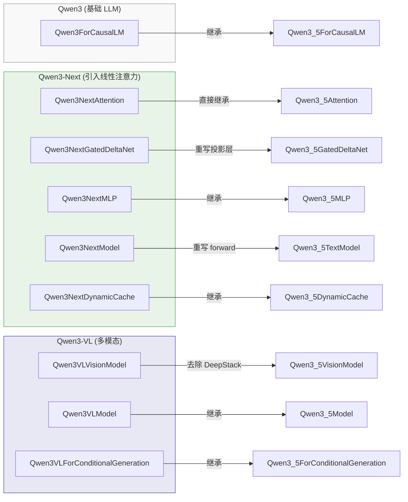

---

## 3. 文本解码器 (Qwen3_5TextModel)

### 3.1 默认配置 (9B-Instruct)

| 参数 | 值 | 说明 |
|------|-----|------|
| `vocab_size` | 248,320 | 词表大小 |
| `hidden_size` | 4,096 | 隐藏层维度 |
| `intermediate_size` | 12,288 | MLP 中间维度 |
| `num_hidden_layers` | 32 | 解码器层数 |
| `num_attention_heads` | 16 | 注意力头数 |
| `num_key_value_heads` | 4 | KV 头数 (GQA, 4组) |
| `head_dim` | 256 | 每个注意力头的维度 |
| `max_position_embeddings` | 32,768 | 最大序列长度 |
| `rms_norm_eps` | 1e-6 | RMSNorm epsilon |
| `hidden_act` | silu | 激活函数 |
| `attention_bias` | False | 注意力无偏置 |

### 3.2 线性注意力配置

| 参数 | 值 | 说明 |
|------|-----|------|
| `linear_conv_kernel_dim` | 4 | 因果卷积核大小 |
| `linear_key_head_dim` | 128 | 线性注意力 Key 头维度 |
| `linear_value_head_dim` | 128 | 线性注意力 Value 头维度 |
| `linear_num_key_heads` | 16 | 线性注意力 Key 头数 |
| `linear_num_value_heads` | 32 | 线性注意力 Value 头数 |

### 3.3 层类型交替模式

默认 `full_attention_interval = 4`，即每 4 层中有 1 层是 Full Attention，其余 3 层是 Linear Attention。32 层中共 8 层 Full Attention + 24 层 Linear Attention (GatedDeltaNet)。

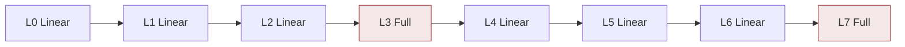

> 以上为前 8 层示意，后续 L8-L31 重复同样的 `linear, linear, linear, full` 模式。

---

## 4. Qwen3_5DecoderLayer 详解

### 4.1 Full Attention 层

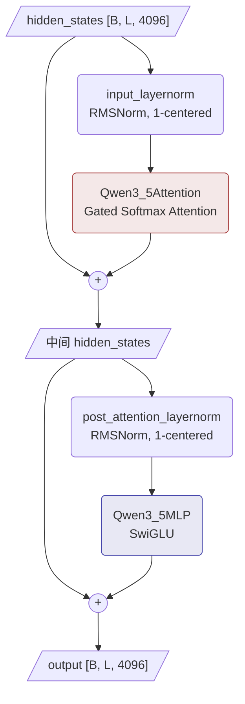

### 4.2 Linear Attention 层

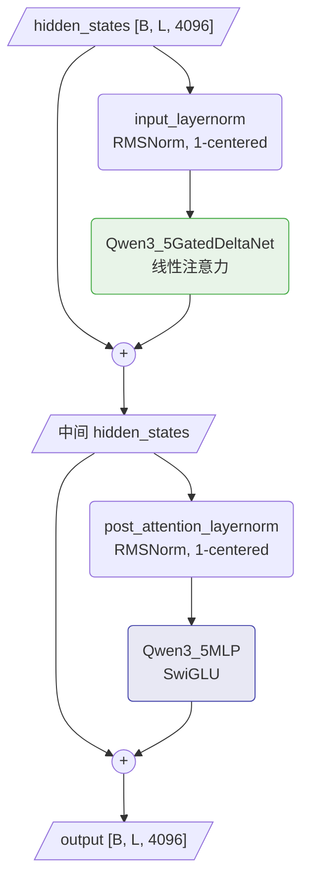


---

## 5. Qwen3_5Attention (Full Attention 层)

这是 Qwen3.5 最关键的创新之一 —— **Gated Attention**。

### 5.1 完整数据流图

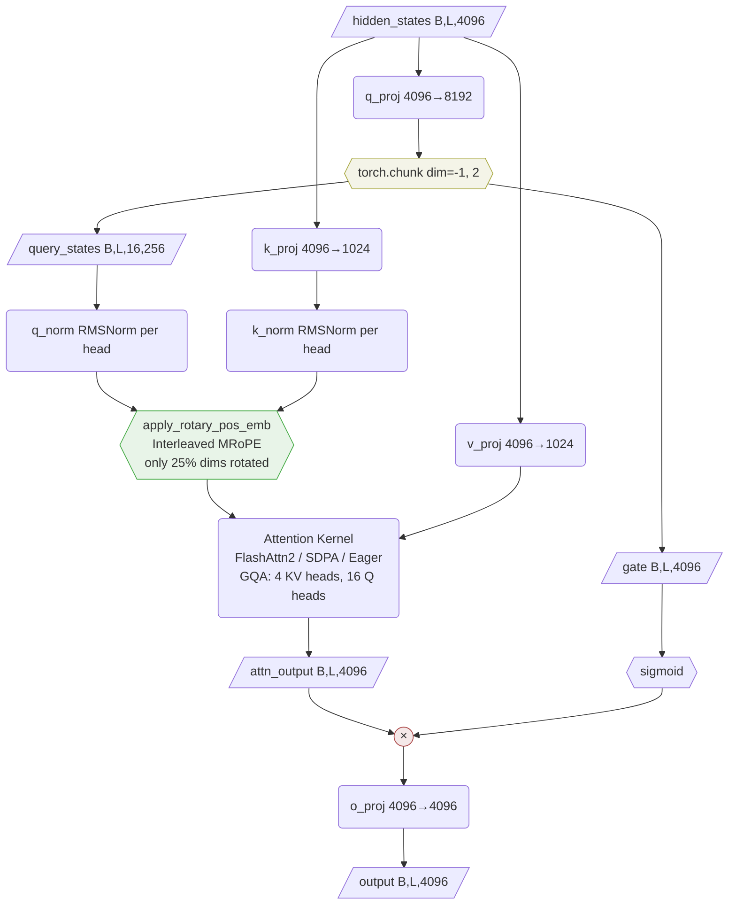

### 5.2 Gate 机制示意

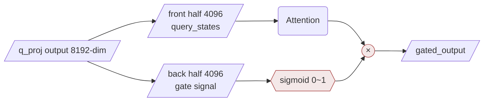

> gate ≈ 0 → 该维度信息被抑制；gate ≈ 1 → 完全通过；gate ≈ 0.5 → 减半

### 5.3 关键特性

1. **QK-Norm**: Query 和 Key 都经过 RMSNorm 归一化（per head），稳定训练
2. **Gated Output**: `q_proj` 输出 2 倍维度，一半作为 gate，通过 `sigmoid(gate) * attn_output` 控制信息流
3. **GQA**: 16 个 Q 头, 4 个 KV 头 (4:1 分组)
4. **head_dim = 256**: 较大的头维度（常见模型通常为 128）


---

## 6. Qwen3_5GatedDeltaNet (Linear Attention 层)

基于 Gated Delta Rule 的线性注意力，是 Qwen3.5 的核心创新。

### 6.1 完整数据流图

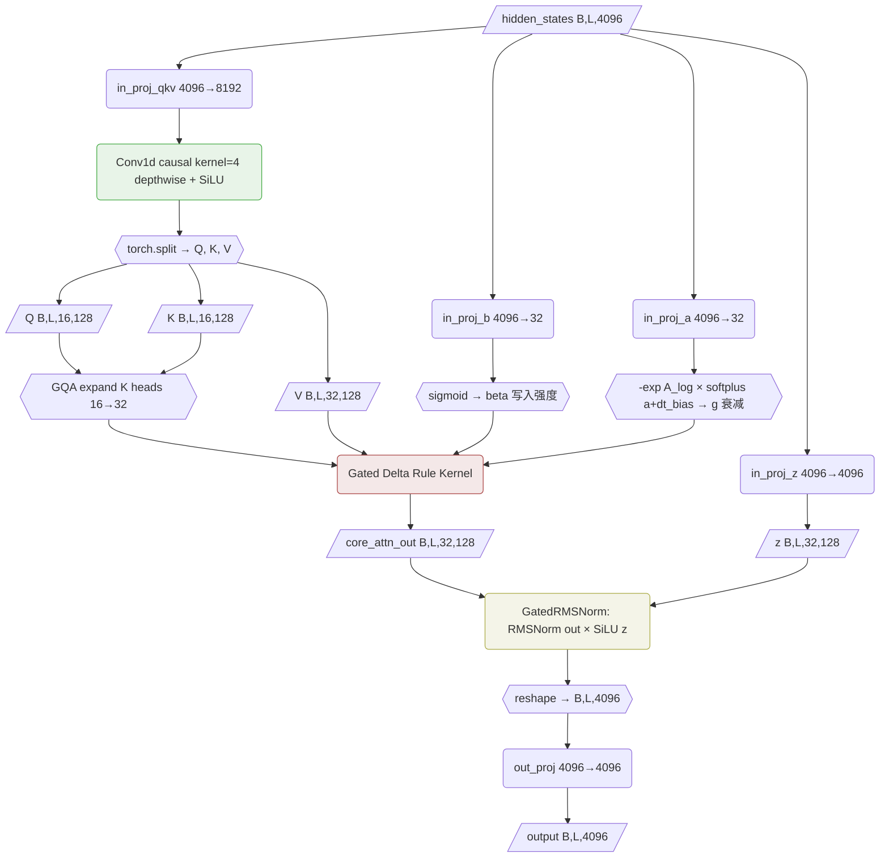

### 6.2 与 Qwen3-Next 的区别

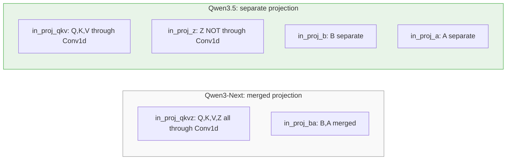

> 关键区别: Z (gate) 不经过 Conv1d → gate 直接从当前 token 计算，不受局部上下文影响；QKV 通过 Conv1d 获得局部上下文信息 (kernel=4)。

### 6.3 为什么需要线性注意力?

标准 Softmax Attention 的核心问题是复杂度:

- `Q @ K^T` 产生 `[L, L]` 矩阵 → 时间 O(L²·d)，空间 O(L²)
- 推理时 KV Cache 随序列长度 O(L) 持续增长

线性注意力的思路: 用一个固定大小的"状态矩阵" `S ∈ R^{d_k × d_v}` 压缩历史信息:

- 时间 O(L·d_k·d_v)，与 L 线性
- 推理缓存 O(d_k·d_v) 恒定，不随 L 增长

### 6.4 从关联记忆的角度理解

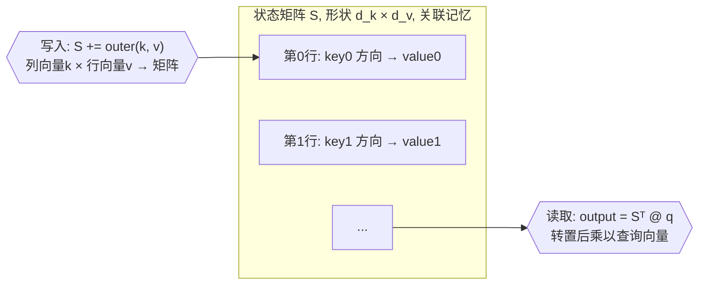

### 6.5 从朴素到完整: 三步演进

> 符号说明: `⊗` 表示外积 (outer product)，即列向量 × 行向量 → 矩阵。
> 例: k=[1,0] 与 v=[0.9,0.1] 的外积 = k 作为列 × v 作为行 = [[0.9, 0.1], [0, 0]]，结果是 d_k × d_v 矩阵。
> `Sᵀ` 表示矩阵 S 的转置 (行列互换)。`@` 表示矩阵乘法。

**第一步: 朴素线性注意力** — 每步把 k,v 写入 S，用 q 读出

```
S_t = S_{t-1} + outer(k_t, v_t)     (追加写入, outer = 列向量k × 行向量v → 矩阵)
o_t = Sᵀ_t @ q_t                    (检索)
```

问题: S 只增不减，旧信息永远不遗忘 → 信息混杂

**第二步: 加入衰减 (Gated)** — 每步先衰减旧信息再写入

```
S_t = exp(g_t) × S_{t-1} + outer(k_t, v_t)
      ──────────────────   ────────────────
      衰减旧信息 (g<0)      写入新信息
```

g 越负 → exp(g) 越小 → 遗忘越快

**第三步: 加入 Delta Rule** — 不盲目写入 v，先检查已有内容，只写入"差异"

```
retrieved = Sᵀ @ k_t                            (用 key 查已存内容)
delta = (v_t - retrieved) × beta_t               (新旧差异 × 写入强度)
S_t = exp(g_t) × S_{t-1} + outer(k_t, delta)    (写入差异)
```

效果: 类似数据库 UPSERT — 有则更新，无则插入

### 6.6 完整单步递推 (5 步)

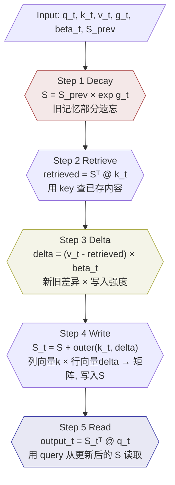

对应代码 (`torch_recurrent_gated_delta_rule`):

```python
for i in range(sequence_length):
    q_t = query[:, :, i]                                    # [B, H, d_k]
    k_t = key[:, :, i]                                      # [B, H, d_k]
    v_t = value[:, :, i]                                    # [B, H, d_v]
    g_t = g[:, :, i].exp().unsqueeze(-1).unsqueeze(-1)      # exp(g) → [B,H,1,1]
    beta_t = beta[:, :, i].unsqueeze(-1)                    # [B, H, 1]

    S = S * g_t                                              # Step 1: 衰减
    retrieved = (S * k_t.unsqueeze(-1)).sum(dim=-2)          # Step 2: 检索
    delta = (v_t - retrieved) * beta_t                       # Step 3: 增量
    S = S + k_t.unsqueeze(-1) * delta.unsqueeze(-2)          # Step 4: 写入
    output[i] = (S * q_t.unsqueeze(-1)).sum(dim=-2)          # Step 5: 读取
```

### 6.7 完整数值例子: GatedDeltaNet 逐步推演

用一个 **2 头、d=4** 的最小例子，从原始 hidden_states 开始，走完投影 → Conv1d → 激活 → 多头 Delta Rule 的全流程。

#### 设定

```
hidden_size d       = 4          # 输入维度
num_heads H         = 2          # 2 个头
d_k = 2, d_v = 2                 # 每头的 key/value 维度
d_qkv = H*(d_k+d_k+d_v) = 12    # QKV 总投影维度
conv_kernel_size    = 4          # 因果卷积核大小
序列长度 L          = 4          # 4 个 token
```

```
每头的状态矩阵 S 形状: [d_k, d_v] = [2, 2]
初始状态: S⁰₀ = S¹₀ = [[0,0],[0,0]]   (上标=头编号, 下标=时间步)
```

---

#### Phase 1: 线性投影

`in_proj_qkv` 是一个 [d, d_qkv] = [4, 12] 的权重矩阵，把每个 token 的 4 维 hidden_states 投影到 12 维:

```
x₁ = [1.0, 0.5, -0.3, 0.8]    # Token 1 的 hidden_states
x₂ = [0.2, -1.0, 0.7, 0.1]    # Token 2
x₃ = [-0.5, 0.3, 1.0, -0.2]   # Token 3
x₄ = [0.8, 0.1, -0.6, 0.9]    # Token 4

projected_t = W_qkv @ x_t      # 每个 token: [4] → [12]
```

假设投影后得到 (省略具体权重矩阵，直接给结果):

```
proj₁ = [ 0.5,  0.3, -0.2,  0.8,  0.1, -0.4,  0.7,  0.2,  0.6, -0.1,  0.3,  0.9]
proj₂ = [-0.1,  0.7,  0.4, -0.3,  0.6,  0.2, -0.5,  0.8,  0.1,  0.4, -0.2,  0.5]
proj₃ = [ 0.3, -0.6,  0.1,  0.5, -0.3,  0.7,  0.2, -0.1,  0.4,  0.8,  0.6, -0.3]
proj₄ = [ 0.8,  0.1,  0.5, -0.2,  0.4,  0.3, -0.6,  0.7,  0.3, -0.5,  0.1,  0.4]
         ─────────────────────────────────────────────────────────────────────────────
         12 维, 稍后会被 split 成 Q(4) + K(4) + V(4)
```

---

#### Phase 2: Causal Depthwise Conv1d (核心难点)

Conv1d 作用在投影结果上，**不是**对 token 做卷积，而是对**每个通道沿时间轴**做卷积。

**什么是 Depthwise?** 12 个通道各自有独立的卷积核，互不干扰。等价于 12 个独立的 1D 卷积。

**什么是 Causal?** 卷积核只看当前和过去的 token，不看未来。kernel=4 意味着看 [t-3, t-2, t-1, t]。

以**通道 0** 为例 (kernel=4, 假设权重 w=[0.1, 0.2, 0.3, 0.4]):

```
通道 0 在 4 个时间步的值:  [proj₁[0], proj₂[0], proj₃[0], proj₄[0]] = [0.5, -0.1, 0.3, 0.8]

因果卷积 = 左边补 3 个零 (kernel-1=3), 然后滑动窗口:

时间步:    pad pad pad  t=1   t=2   t=3   t=4
值:         0   0   0   0.5  -0.1   0.3   0.8
            ─────────
窗口 t=1:  [0,   0,   0,   0.5] · [0.1, 0.2, 0.3, 0.4] = 0×0.1 + 0×0.2 + 0×0.3 + 0.5×0.4 = 0.20
                ─────────
窗口 t=2:  [0,   0,   0.5, -0.1] · [0.1, 0.2, 0.3, 0.4] = 0 + 0 + 0.15 + (-0.04) = 0.11
                     ─────────
窗口 t=3:  [0,   0.5, -0.1, 0.3] · [0.1, 0.2, 0.3, 0.4] = 0 + 0.10 + (-0.03) + 0.12 = 0.19
                          ─────────
窗口 t=4:  [0.5, -0.1, 0.3, 0.8] · [0.1, 0.2, 0.3, 0.4] = 0.05 + (-0.02) + 0.09 + 0.32 = 0.44
```

> 关键: t=1 时只能看到自己 (前面全是 0)，t=4 时能看到 t=1~t=4 全部 4 个 token。
> 这就是 "局部上下文融合" — 每个 token 的 QKV 会混入最近 3 个邻居的信息。

**其余 11 个通道完全一样的流程**，只是各自有不同的卷积核权重。12 个通道独立卷积，互不影响。

**推理模式下的 conv_states (滑动窗口缓存)**:

训练时可以一次性对整个序列做卷积。但推理时是逐 token 生成，所以需要缓存最近 3 个投影值:

```
conv_states 形状: [d_qkv, kernel-1] = [12, 3]

处理 Token 4 时, conv_states 存的是 Token 1~3 的投影:
  通道 0: conv_states[0] = [0.5, -0.1, 0.3]   ← 最近 3 个时间步的通道 0 值
  通道 1: conv_states[1] = [0.3,  0.7, -0.6]   ← 最近 3 个时间步的通道 1 值
  ...

收到 Token 4 的投影 proj₄[0]=0.8 后:
  窗口 = [conv_states[0], proj₄[0]] = [0.5, -0.1, 0.3, 0.8]
  卷积 = [0.5, -0.1, 0.3, 0.8] · [0.1, 0.2, 0.3, 0.4] = 0.44  (和训练模式结果一致!)
  更新 conv_states[0] = [-0.1, 0.3, 0.8]   ← 滑动: 丢掉最老的, 加入最新的
```

> conv_states 就是一个滑动窗口，大小恒定 [12, 3]，不随序列长度增长。

---

#### Phase 3: SiLU 激活 + Split 成 Q, K, V

Conv1d 输出后，经过 SiLU 激活 (x × sigmoid(x))，然后 split 成 Q, K, V:

```
conv_out₄ = [0.44, ..., ...]   # 12 维 (省略其余通道的具体值)

after_silu₄ = SiLU(conv_out₄)  # 逐元素: x × sigmoid(x)

# Split 成 Q(4维), K(4维), V(4维):
Q₄_flat = after_silu₄[0:4]     # 前 4 维给 Q
K₄_flat = after_silu₄[4:8]     # 中 4 维给 K
V₄_flat = after_silu₄[8:12]    # 后 4 维给 V
```

**Reshape 成多头**: 4 维 → 2 头 × 2 维/头

```
Q₄_flat = [q₀, q₁, q₂, q₃]
  → Head 0: q⁰₄ = [q₀, q₁]     # 前 2 维
  → Head 1: q¹₄ = [q₂, q₃]     # 后 2 维

K₄_flat = [k₀, k₁, k₂, k₃]
  → Head 0: k⁰₄ = [k₀, k₁]
  → Head 1: k¹₄ = [k₂, k₃]

V₄_flat = [v₀, v₁, v₂, v₃]
  → Head 0: v⁰₄ = [v₀, v₁]
  → Head 1: v¹₄ = [v₂, v₃]
```

> 每个头拿到自己的 q, k, v (各 2 维)，然后**独立**做 Delta Rule。

---

#### Phase 4: 其他投影 (z, β, g)

这三个投影**不经过 Conv1d**，直接从 x_t 算出:

```
z₄ = W_z @ x₄           # [4] → [4], reshape 成 2头×2维, 用于输出门控
β₄ = sigmoid(W_b @ x₄)  # [4] → [H]=[2], 每头一个标量, 控制写入强度
g₄ = -exp(A_log) × softplus(W_a @ x₄ + dt_bias)  # [4] → [H]=[2], 每头一个标量, 控制衰减
```

> z 不经过 Conv1d 是有意设计: gate 只基于当前 token 语义，不受邻居影响。

---

#### Phase 5: 多头 Delta Rule

现在每个头独立工作。假设经过上述全部步骤后，Token 1~3 在两个头上得到:

```
Head 0:                                          Head 1:
  q⁰₁=[1.0, 0.0]  k⁰₁=[1.0, 0.0]  v⁰₁=[0.9, 0.1]    q¹₁=[0.5, 0.5]  k¹₁=[0.7, 0.3]  v¹₁=[0.4, 0.6]
  q⁰₂=[0.0, 1.0]  k⁰₂=[0.0, 1.0]  v⁰₂=[0.2, 0.8]    q¹₂=[0.3, 0.7]  k¹₂=[0.2, 0.8]  v¹₂=[0.5, 0.5]
  q⁰₃=[1.0, 0.0]  k⁰₃=[1.0, 0.0]  v⁰₃=[0.3, 0.7]    q¹₃=[0.8, 0.2]  k¹₃=[0.6, 0.4]  v¹₃=[0.1, 0.9]

  g⁰₁=-0.1, β⁰₁=1.0                                    g¹₁=-0.1, β¹₁=1.0
  g⁰₂=-0.1, β⁰₂=1.0                                    g¹₂=-0.1, β¹₂=1.0
  g⁰₃=-0.05, β⁰₃=0.8                                   g¹₃=-0.05, β¹₃=0.8
```

下面以 **Head 0** 详细展示 3 步 Delta Rule，Head 1 同理。

##### Head 0 — Token 1: 写入 "猫=可爱"

```
输入: q⁰₁=[1, 0], k⁰₁=[1, 0], v⁰₁=[0.9, 0.1], g⁰₁=-0.1, β⁰₁=1.0
状态: S⁰₀ = [[0,0],[0,0]]
```

**Step 1 — 衰减**: S = S⁰₀ × exp(-0.1) = [[0,0],[0,0]] × 0.905 = [[0,0],[0,0]]

> S 是空的，衰减没有效果。

**Step 2 — 检索**: retrieved = Sᵀ @ k⁰₁ = [[0,0],[0,0]]ᵀ @ [1,0] = [0, 0]

> 字典里没有 k₁ 对应的内容。

**Step 3 — 计算增量**: delta = (v⁰₁ - retrieved) × β⁰₁ = ([0.9, 0.1] - [0, 0]) × 1.0 = [0.9, 0.1]

> 没有旧内容，增量就是 v₁ 本身。

**Step 4 — 写入**: S⁰₁ = S + outer(k⁰₁, delta)

```
outer(k⁰₁, delta) = [1, 0]ᵀ × [0.9, 0.1] = [[0.9, 0.1],
                                               [0.0, 0.0]]

S⁰₁ = [[0, 0], [0, 0]] + [[0.9, 0.1], [0, 0]] = [[0.9, 0.1],
                                                     [0.0, 0.0]]
```

> S⁰₁ 的第 0 行记住了: key=[1,0] 方向 → value=[0.9, 0.1] ("猫=可爱")

**Step 5 — 读取**: o⁰₁ = (S⁰₁)ᵀ @ q⁰₁ = **[0.9, 0.1]** ✓

**Head 0 缓存**: `S⁰₁ = [[0.9, 0.1], [0.0, 0.0]]`

---

##### Head 0 — Token 2: 写入 "狗=忠诚"

```
输入: q⁰₂=[0, 1], k⁰₂=[0, 1], v⁰₂=[0.2, 0.8], g⁰₂=-0.1, β⁰₂=1.0
状态: S⁰₁ = [[0.9, 0.1], [0.0, 0.0]]
```

**Step 1 — 衰减**: S = S⁰₁ × exp(-0.1) = S⁰₁ × 0.905

```
S = [[0.814, 0.090],
     [0.000, 0.000]]
```

> "猫=可爱" 的记忆略微衰减 (0.9→0.814)。

**Step 2 — 检索**: retrieved = Sᵀ @ k⁰₂ = Sᵀ @ [0, 1] = [0, 0]

> k⁰₂=[0,1] 方向 (第 1 行) 是空的，没有旧内容。

**Step 3 — 计算增量**: delta = ([0.2, 0.8] - [0, 0]) × 1.0 = [0.2, 0.8]

**Step 4 — 写入**: S⁰₂ = S + outer(k⁰₂, delta)

```
outer(k⁰₂, delta) = [0, 1]ᵀ × [0.2, 0.8] = [[0.0, 0.0],
                                               [0.2, 0.8]]

S⁰₂ = [[0.814, 0.090],    +    [[0.0, 0.0],    =    [[0.814, 0.090],
        [0.000, 0.000]]          [0.2, 0.8]]           [0.200, 0.800]]
```

> S⁰₂ 现在存了两条记录: 第 0 行 ≈ "猫=可爱"(衰减后), 第 1 行 = "狗=忠诚"

**Step 5 — 读取**: o⁰₂ = (S⁰₂)ᵀ @ q⁰₂ = (S⁰₂)ᵀ @ [0, 1] = **[0.2, 0.8]** ✓

**Head 0 缓存**: `S⁰₂ = [[0.814, 0.090], [0.200, 0.800]]`

---

##### Head 0 — Token 3: 更新 "猫=高冷" (Delta Rule 核心场景)

```
输入: q⁰₃=[1, 0], k⁰₃=[1, 0], v⁰₃=[0.3, 0.7], g⁰₃=-0.05, β⁰₃=0.8
状态: S⁰₂ = [[0.814, 0.090], [0.200, 0.800]]
```

**Step 1 — 衰减**: S = S⁰₂ × exp(-0.05) = S⁰₂ × 0.951

```
S = [[0.814 × 0.951, 0.090 × 0.951],    =    [[0.774, 0.086],
     [0.200 × 0.951, 0.800 × 0.951]]           [0.190, 0.761]]
```

**Step 2 — 检索**: retrieved = Sᵀ @ k⁰₃ = Sᵀ @ [1, 0] = [0.774, 0.086]

> 用 k⁰₃=[1,0] 查字典，找到了旧内容 [0.774, 0.086] ≈ 衰减后的 "猫=可爱"!

**Step 3 — 计算增量**: delta = (v⁰₃ - retrieved) × β⁰₃

```
delta = ([0.3, 0.7] - [0.774, 0.086]) × 0.8
      = [-0.474, 0.614] × 0.8
      = [-0.379, 0.491]
```

> 这是关键! Delta Rule 不是盲目写入 v⁰₃，而是计算 "新值 - 旧值" 的差异。
> β⁰₃=0.8 控制更新力度 (0=不更新, 1=完全更新)。

**Step 4 — 写入**: S⁰₃ = S + outer(k⁰₃, delta)

```
outer(k⁰₃, delta) = [1, 0]ᵀ × [-0.379, 0.491] = [[-0.379, 0.491],
                                                     [0.000,  0.000]]

S⁰₃ = [[0.774, 0.086],    +    [[-0.379, 0.491],    =    [[0.395, 0.577],
        [0.190, 0.761]]          [0.000,  0.000]]           [0.190, 0.761]]
```

> 第 0 行从 [0.774, 0.086] 更新为 [0.395, 0.577]，向 v⁰₃=[0.3, 0.7] 靠拢!
> 第 1 行 "狗=忠诚" 不受影响 (因为 k⁰₃ 的第 1 维是 0)。

**Step 5 — 读取**: o⁰₃ = (S⁰₃)ᵀ @ q⁰₃ = (S⁰₃)ᵀ @ [1, 0] = **[0.395, 0.577]**

**Head 0 缓存**: `S⁰₃ = [[0.395, 0.577], [0.190, 0.761]]`

---

##### Head 1 — 同样的流程，不同的数据

Head 1 用自己的 q¹, k¹, v¹ 独立做完全一样的 5 步 Delta Rule，维护自己的状态矩阵 S¹。过程省略，直接给 Token 3 后的结果:

```
Head 1 Token 3 后:
  S¹₃ = [[0.312, 0.688],     # Head 1 自己的记忆
         [0.445, 0.521]]
  o¹₃ = (S¹₃)ᵀ @ q¹₃ = (S¹₃)ᵀ @ [0.8, 0.2] = [0.339, 0.654]
```

> 关键: 两个头的 S 矩阵完全独立，互不干扰。每个头学到不同的 "记忆模式"。

---

#### Phase 6: 合并多头 + GatedRMSNorm + 输出投影

```
Token 3 的两个头输出:
  o⁰₃ = [0.395, 0.577]    # Head 0 的 2 维输出
  o¹₃ = [0.339, 0.654]    # Head 1 的 2 维输出

拼接: o₃ = concat(o⁰₃, o¹₃) = [0.395, 0.577, 0.339, 0.654]   # 恢复为 4 维
```

然后经过 GatedRMSNorm (用 z 门控) 和输出投影:

```
normed₃ = RMSNorm(o₃)                          # 归一化
z₃ = W_z @ x₃ = [0.6, -0.3, 1.2, 0.1]         # z 投影 (不经过 Conv1d!)
gated₃ = normed₃ × SiLU(z₃)                    # 逐元素门控
y₃ = W_out @ gated₃                             # 输出投影 [4] → [4]
```

> z 的作用: SiLU(z) 中，z 大的维度信号通过，z≈0 的维度被关闭。
> 这让模型可以选择性地使用 Delta Rule 检索到的信息。

---

#### 对比: 如果没有 Delta Rule (朴素写入)

朴素线性注意力在 Token 3 直接做 S = S + k₃ ⊗ v₃ᵀ:

```
S₃_naive = [[0.774 + 0.3, 0.086 + 0.7],    =    [[1.074, 0.786],
             [0.190,       0.761      ]]           [0.190, 0.761]]
```

读取: o₃ = [1.074, 0.786] — 这是旧值和新值的混合，既不是 "可爱" 也不是 "高冷"!

| | Delta Rule | 朴素写入 |
|---|---|---|
| Token 3 读取 | [0.395, 0.577] ≈ 目标 [0.3, 0.7] | [1.074, 0.786] ← 混乱 |
| 行为 | UPSERT: 检测到旧值，用差异更新 | INSERT: 盲目追加，新旧混杂 |

---

#### 推理时的缓存结构

GatedDeltaNet 层的 "KV Cache" 不是传统的 key/value 列表，而是两个固定大小的状态:

```
cache = {
    "conv_states":      形状 [B, d_qkv, kernel-1]  = [B, 8192, 3]     # Conv1d 的滑动窗口 (最近 3 个投影值)
    "recurrent_states": 形状 [B, H, d_k, d_v]       = [B, 32, 128, 128] # 每个头的状态矩阵 S
}
```

```
推理第 N 个 token 时:
  1. 从 cache 加载 conv_states 和 S (32 个头各自的 S 矩阵)
  2. W_qkv @ x_N → 得到 8192 维投影
  3. 用 conv_states 做因果卷积: [最近3个投影, 当前投影] · kernel → 融合局部上下文
  4. 更新 conv_states: 滑动窗口丢掉最老的, 加入当前投影
  5. SiLU 激活 → split 成 Q, K, V → reshape 成 32 头
  6. 每个头独立做单步 Delta Rule (5 步), 更新各自的 S
  7. 拼接 32 头输出 → GatedRMSNorm → 输出投影
  8. 把更新后的 conv_states 和 32 个 S 写回 cache
  → 无论已处理多少 token，cache 大小恒定!
```

对比 Full Attention 的 KV Cache:

| | Full Attention | GatedDeltaNet |
|---|---|---|
| 缓存内容 | 所有历史 token 的 K, V 向量 | 状态矩阵 S + Conv1d 窗口 |
| 缓存形状 | [B, H, **seq_len**, d] — 随 seq_len 增长 | [B, H, d_k, d_v] — **恒定** |
| 第 10000 个 token | 存了 10000 个 KV 对 | 还是同一个 S 矩阵 |
| 每步计算 | O(seq_len × d) | O(d_k × d_v) |

---

#### 完整数学表达式总结

给定第 t 个 token 的输入 hidden_states `x_t ∈ R^d`，GatedDeltaNet 单层的完整计算:

**1. 投影**

```
[q_t; k_t; v_t] = SiLU( CausalConv1d( W_qkv @ x_t ) )
z_t              = W_z @ x_t                                  ← 不经过 Conv1d
β_t              = sigmoid( W_b @ x_t )          ∈ (0, 1)     ← 写入强度
g_t              = -exp(A_log) · softplus(W_a @ x_t + b_dt)   < 0  ← 衰减率
```

**2. Gated Delta Rule 递推** (每个头独立, 省略头下标)

> 符号: `outer(a, b)` = 列向量 a × 行向量 b → 矩阵。`Sᵀ` = S 的转置。`⊙` = 逐元素相乘。

```
┌─────────────────────────────────────────────────────────────────────────────┐
│                                                                             │
│  delta_t = β_t · (v_t - Sᵀ_{t-1} @ k_t)        ← (新值 - 旧值) × 写入强度 │
│            ───         ───────────────                                       │
│          写入强度       用 k 查出旧值                                         │
│                                                                             │
│  S_t = exp(g_t) · S_{t-1}  +  outer(k_t, delta_t)    ← 状态矩阵更新        │
│        ─────────────────     ─────────────────────                           │
│          衰减旧记忆              把差异写入 S                                 │
│                                                                             │
│  o_t = Sᵀ_t @ q_t                                     ← 用 q 读取结果       │
│                                                                             │
└─────────────────────────────────────────────────────────────────────────────┘
```

其中 `S_t ∈ R^{d_k × d_v}` 是状态矩阵 (即 "KV Cache")，形状恒定不随序列长度变化。

**3. 输出门控**

```
y_t = W_out @ ( RMSNorm(o_t) ⊙ SiLU(z_t) )
                ────────────   ──────────
                归一化输出       z 门控 (选择性通过)
```

**完整单步展开** (把 Step 1-5 合并为一个表达式):

```
o_t = [ exp(g_t)·S_{t-1}  +  outer(k_t, β_t·(v_t - Sᵀ_{t-1} @ k_t)) ]ᵀ @ q_t
        ────────────────     ──────────────────────────────────────────
              衰减                          Delta 写入
```

> 直觉: 每一步都在做 "先遗忘一点旧知识 → 查一下这个 key 对应的旧 value → 算出新旧差异 → 把差异写进去 → 用 query 读出结果"。状态矩阵 S 就是一个不断被更新的压缩记忆体。

### 6.8 关键参数的含义

| 参数 | 公式 | 范围 | 含义 |
|------|------|------|------|
| g (衰减) | `-exp(A_log) × softplus(a + dt_bias)` | 始终 < 0 | exp(g) ∈ (0,1)，控制遗忘速度 |
| beta (写入) | `sigmoid(b)` | (0, 1) | 控制新信息写入比例 |
| z (输出门) | 通过 `in_proj_z` 投影 | 任意实数 | 经 SiLU 后门控输出 |
| A_log | 可学习参数 | 初始化 log(U(0,16)) | 衰减基数 |
| dt_bias | 可学习参数 | 初始化全 1 | 时间步偏置 |

### 6.9 Conv1d 的作用

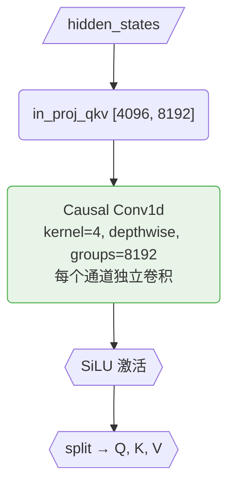

> Conv1d 在投影之后、Delta Rule 之前加入局部上下文: token_t 的 QKV 会融合 token_{t-3} 到 token_t 的信息，补偿递推模型缺乏的局部感知。类似于 Mamba 中的 Conv1d。

### 6.10 训练模式 vs 推理模式

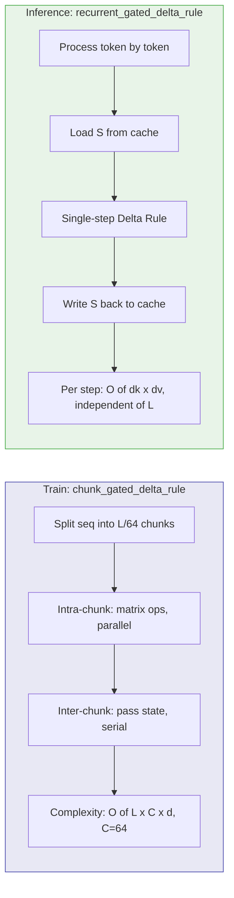

#### 6.10.1 核心矛盾：Delta Rule 的链式依赖

朴素线性注意力 `S_t = S_{t-1} + outer(k_t, v_t)` 是简单的 cumsum，天然可并行（prefix sum）。但 Delta Rule 引入了**循环依赖**：

```
δ_t = β_t · (v_t − Sᵀ_{t-1} @ k_t)        ← δ 依赖 S
S_t = exp(g_t) · S_{t-1} + outer(k_t, δ_t)  ← S 依赖 δ
```

每一步的写入 δ_t 依赖当前状态 S_t 的读取结果，而 S_t 又依赖之前所有步的 δ。这使得逐 token 串行递推成为唯一的朴素实现方式。

**Chunk 并行的核心思路**: 把长度 L 的序列切成 L/C 个 chunk (C=64)，在 chunk 内部用矩阵运算一次性解析求解这个循环依赖，chunk 之间只需串行传递一个固定大小的状态矩阵 S。

#### 6.10.2 数学推导：从递推到线性方程组

> 以下推导省略头下标，对 chunk 内位置 t = 0, 1, ..., C-1。
> 符号: `⊗` = 外积, `α_t = exp(g_t)` = 衰减系数, `G_t = Σ_{m=0}^{t} g_m` = g 的前缀和。

**Step 1 — 定义辅助变量**

```
ṽ_t = β_t · v_t        (原始写入值, 代码中的 v_beta)
k̃_t = β_t · k_t        (原始写入 key, 代码中的 k_beta)
γ_{t,j} = exp(G_t - G_j)  (位置 j 到位置 t 的累积衰减, 代码中的 decay_mask[t][j])
```

对应代码 (`modeling_qwen3_5.py:353-364`):

```python
v_beta = value * beta.unsqueeze(-1)                              # ṽ_t = β_t · v_t
k_beta = key * beta.unsqueeze(-1)                                # k̃_t = β_t · k_t
g = g.cumsum(dim=-1)                                             # G_t = g_0 + g_1 + ... + g_t
decay_mask = ((g.unsqueeze(-1) - g.unsqueeze(-2)).tril().exp())  # γ_{t,j} = exp(G_t - G_j)
```

**Step 2 — 展开 δ_t 的依赖关系**

只看 chunk 内部贡献（暂时忽略 chunk 初始状态 S₀），chunk 内的局部状态为:

```
S_t^local = Σ_{j=0}^{t-1} γ_{t,j} · k_j ⊗ δ_j
```

将 δ_t 的定义展开:

```
δ_t = ṽ_t − β_t · (S_t^local)ᵀ @ k_t
    = ṽ_t − Σ_{j<t} γ_{t,j} · (k̃_tᵀ · k_j) · δ_j
```

> 直觉: 位置 t 的实际写入 = 原始写入 ṽ_t − (之前所有位置写入的内容在 k_t 方向上的投影之和)

**Step 3 — 定义交互矩阵 M**

定义 C×C 的严格下三角矩阵 M:

```
M[t][j] = −γ_{t,j} · (k̃_tᵀ · k_j),    j < t
M[t][j] = 0,                              j ≥ t
```

则 δ 满足的线性方程组为:

```
δ_t = ṽ_t + Σ_{j<t} M[t][j] · δ_j

矩阵形式:  δ = ṽ + M · δ
           (I − M) · δ = ṽ
           δ = (I − M)⁻¹ · ṽ
```

对应代码 (`modeling_qwen3_5.py:365`):

```python
# M = -(k_beta @ key^T) * decay_mask, 上三角置零
attn = -((k_beta @ key.transpose(-1, -2)) * decay_mask).masked_fill(mask, 0)
```

> `k_beta @ key^T` 的 [t,j] 元素 = k̃_tᵀ · k_j = β_t(k_tᵀ · k_j)
> 乘以 decay_mask[t][j] = γ_{t,j}，取负号，上三角置零 → 得到 M

#### 6.10.3 求解 Resolvent 矩阵 R = (I − M)⁻¹

因为 M 是**严格下三角**矩阵 (对角线全 0)，所以 M 是幂零矩阵 (M^C = 0)，Neumann 级数精确截断:

```
R = (I − M)⁻¹ = I + M + M² + M³ + ... + M^{C-1}
```

代码用**逐行迭代**高效计算 R，而非显式做矩阵幂 (`modeling_qwen3_5.py:366-370`):

```python
for i in range(1, chunk_size):
    row = attn[..., i, :i].clone()         # R 的第 i 行, 前 i 个元素
    sub = attn[..., :i, :i].clone()        # R 的左上 i×i 子矩阵
    attn[..., i, :i] = row + (row.unsqueeze(-1) * sub).sum(-2)
    # 等价于: R[i, :i] = M[i, :i] + M[i, :i] @ R[:i, :i]
    # 含义: 位置 i 受到的总影响 = 直接影响 M[i,j] + 间接影响 (M[i,k] 经 k 传递到 j 的 R[k,j])

attn = attn + torch.eye(chunk_size)  # R = resolvent + I
```

> 因为是下三角，从第 1 行到第 C-1 行顺序迭代一遍即可精确求解。
> 直觉: 多米诺骨牌效应 — 不用逐个推倒，直接算出每个骨牌最终倒在哪里。

然后用 R 一次性算出所有 δ:

```python
value = attn @ v_beta                              # δ = R @ ṽ (修正后的实际写入值)
k_cumdecay = attn @ (k_beta * g.exp().unsqueeze(-1))  # 修正后的 key (带衰减)
```

对应代码 (`modeling_qwen3_5.py:371-372`)。

**关键: 以上所有计算 (line 363-372) 对所有 chunk 同时并行执行** — reshape 后的张量形状为 `[B, H, num_chunks, C, ...]`，矩阵乘法在 num_chunks 维度上是 batch 并行的。

#### 6.10.4 Chunk 间串行传递状态

Resolvent 只处理了 chunk 内部的交互。chunk 之间还需要考虑旧状态 S^(c) 的贡献。

对第 c 个 chunk，设进入时的状态为 S^(c)，chunk 内每个位置 t 的输出分两部分:

```
output_t = inter_t + intra_t

inter_t = exp(G_t) · qᵀ_t · S^(c)                    ← 从旧状态 S 读取 (跨 chunk)
intra_t = Σ_{j≤t} decay_{t,j} · (qᵀ_t · k_j) · v_j^new  ← chunk 内注意力
```

其中 v^new 需要减去旧状态 S^(c) 的贡献:

```
v'_t = k̃_t^cumdecay · S^(c)     (修正后的 key 从旧 S 检索)
v_t^new = v_t^resolvent − v'_t   (减去旧状态贡献)
```

对应代码 (`modeling_qwen3_5.py:382-392`):

```python
for i in range(num_chunks):                                          # 只有 L/C 步串行!
    q_i, k_i, v_i = query[:,:,i], key[:,:,i], value[:,:,i]

    # chunk 内 Q@K^T 注意力 (C×C 矩阵乘, 并行)
    attn = (q_i @ k_i.transpose(-1, -2) * decay_mask[:,:,i]).masked_fill_(mask, 0)

    # 修正后的 key 从旧 S 检索 → 减去旧状态贡献
    v_prime = k_cumdecay[:,:,i] @ last_recurrent_state
    v_new = v_i - v_prime

    # query 从旧状态读取 (跨 chunk 贡献)
    attn_inter = (q_i * g[:,:,i,:,None].exp()) @ last_recurrent_state

    # 合并: 跨 chunk 读取 + chunk 内注意力
    core_attn_out[:,:,i] = attn_inter + attn @ v_new

    # 更新状态 S 传给下一个 chunk
    # S^(c+1) = exp(G_{C-1}) · S^(c) + Σ_t exp(G_{C-1} - G_t) · k_t ⊗ v_t^new
    last_recurrent_state = (
        last_recurrent_state * g[:,:,i,-1,None,None].exp()            # 旧状态衰减到 chunk 末尾
        + (k_i * (g[:,:,i,-1,None] - g[:,:,i]).exp()[...,None])       # 每个 k 衰减到 chunk 末尾
          .transpose(-1,-2) @ v_new                                    # 写入新值
    )
```

#### 6.10.5 全局流程图

```
┌─────────────────────────────────────────────────────────────────────────┐
│  Step 1: 所有 chunk 并行 (line 353-372)                                │
│                                                                         │
│  计算 v_beta, k_beta ──→ 计算 decay_mask ──→ 计算交互矩阵 M            │
│       ↓                                                                 │
│  求解 Resolvent R = (I-M)^{-1} ──→ 修正 value: δ=R@ṽ, key: k'=R@k̃    │
└────────────────────────────────┬────────────────────────────────────────┘
                                 │
                                 ▼
┌─────────────────────────────────────────────────────────────────────────┐
│  Step 2: chunk 间串行 (line 382-392, 只 L/C 步)                        │
│                                                                         │
│  for each chunk:                                                        │
│    chunk 内 Q@K^T 注意力 ──→ 从旧 S 检索并修正 value                    │
│         ↓                                                               │
│    从旧 S 读取 inter-chunk ──→ 合并输出 ──→ 更新 S 传给下一个 chunk     │
└─────────────────────────────────────────────────────────────────────────┘
```

> **Step 1 详细说明** (所有 chunk 并行):
> - P1: `v_beta = β·v`, `k_beta = β·k`
> - P2: `decay_mask[t][j] = exp(G_t − G_j)`，G 是 g 的前缀和
> - P3: `M = −(k_beta @ kᵀ) × decay_mask`，严格下三角
> - P4: 求解 `R = (I − M)⁻¹`，逐行迭代精确解
> - P5: `δ = R @ v_beta` (修正 value)，`k' = R @ (k_beta · exp(g))` (修正 key)
>
> **Step 2 详细说明** (chunk 间串行，只 L/C 步):
> - S1: `attn = q @ kᵀ × decay_mask`，C×C 矩阵乘，chunk 内并行
> - S2: `v_new = v_resolvent − k_cumdecay @ S`，减去旧状态贡献
> - S3: `inter = q · exp(G) @ S`，query 从旧状态读取
> - S4: `output = inter + attn @ v_new`
> - S5: `S' = S · exp(g_last) + kᵀ @ v_new`，更新状态传给下一个 chunk

#### 6.10.6 复杂度对比

| 方法 | 串行步数 | 每步计算 | 总复杂度 |
|------|---------|---------|---------|
| 纯递推 (推理) | L | O(d_k × d_v) | O(L · d_k · d_v) |
| Chunk 并行 (训练) | L/C | O(C² · d + C · d_k · d_v) | O(L·C·d + L·d_k·d_v) |
| Full Attention | 1 (全并行) | O(L² · d) | O(L² · d) |

> C=64 时，串行步数从 L 降到 L/64，GPU 的并行计算能力被充分利用。
> 例: L=4096 时，纯递推需要 4096 步串行，chunk 并行只需 64 步串行，每步内部的矩阵乘仍然是并行的。

#### 6.10.7 完整数值例子: Chunk 并行 vs 逐步递推

沿用 6.7 节 Head 0 的同一组数据 ("猫=可爱 → 狗=忠诚 → 猫=高冷")，演示 chunk 并行如何得到和逐步递推**完全相同**的结果。

**设定**: 1 个 chunk，C=3，d_k=2，d_v=2，1 个头，初始状态 S₀ = 零矩阵。

```
t=0: q=[1,0], k=[1,0], v=[0.9,0.1], β=1.0, g=-0.1     ("猫=可爱")
t=1: q=[0,1], k=[0,1], v=[0.2,0.8], β=1.0, g=-0.1     ("狗=忠诚")
t=2: q=[1,0], k=[1,0], v=[0.3,0.7], β=0.8, g=-0.05    ("猫=高冷", 更新!)
```

##### Part A: 逐步递推的结果 (6.7 节已算过)

```
t=0: S 为空, δ₀ = β₀·(v₀ - 0) = [0.9, 0.1]
t=1: k₁ 和 k₀ 正交, 检索到 0, δ₁ = [0.2, 0.8]
t=2: S 衰减后检索到旧值 [0.774, 0.086]
     δ₂ = 0.8 × ([0.3, 0.7] - [0.774, 0.086]) = [-0.379, 0.491]
```

##### Part B: Chunk 并行 (代码实际做的)

**Step 1 — 预计算辅助变量** (`modeling_qwen3_5.py:353-354`)

```
v_beta = β·v:                    k_beta = β·k:
  t=0: [0.9,  0.1]                t=0: [1.0, 0.0]
  t=1: [0.2,  0.8]                t=1: [0.0, 1.0]
  t=2: [0.24, 0.56]               t=2: [0.8, 0.0]
       ↑ 0.8×[0.3, 0.7]                ↑ 0.8×[1, 0]
```

**Step 2 — 累积衰减矩阵** (`modeling_qwen3_5.py:363-364`)

```
G = cumsum(g) = [-0.1, -0.2, -0.25]

decay_mask[t][j] = exp(G_t - G_j), 下三角:

         j=0     j=1     j=2
t=0  [ 1.000,     0,      0   ]
t=1  [ 0.905,  1.000,     0   ]    ← exp(-0.2-(-0.1)) = exp(-0.1) = 0.905
t=2  [ 0.861,  0.951,  1.000  ]    ← exp(-0.25-(-0.1)) = exp(-0.15) = 0.861
```

**Step 3 — 交互矩阵 M** (`modeling_qwen3_5.py:365`)

先算 k_beta @ key^T (每对位置的 key 内积 × β):

```
k_beta @ key^T:
         j=0    j=1    j=2
t=0  [  1.0,   0.0,   1.0  ]    ← [1,0]·[1,0]=1, [1,0]·[0,1]=0
t=1  [  0.0,   1.0,   0.0  ]    ← [0,1]·[1,0]=0, [0,1]·[0,1]=1
t=2  [  0.8,   0.0,   0.8  ]    ← [0.8,0]·[1,0]=0.8, [0.8,0]·[0,1]=0
```

M = -(k_beta @ key^T) × decay_mask, 只保留严格下三角:

```
M:
         j=0      j=1    j=2
t=0  [  0,        0,      0  ]    ← 第 0 行没有 j<0
t=1  [  0,        0,      0  ]    ← -0.0×0.905 = 0 (k₁⊥k₀, 正交!)
t=2  [ -0.689,    0,      0  ]    ← -0.8×0.861 = -0.689
```

> 关键观察:
> - M[1][0]=0: k₀=[1,0] 和 k₁=[0,1] 正交 → 位置 1 的写入完全不受位置 0 的影响
> - M[2][0]=-0.689: k₂=[1,0] 和 k₀=[1,0] 平行 → 位置 2 的写入强烈受位置 0 的影响 (Delta Rule 要减去旧值)
> - M[2][1]=0: k₂=[1,0] 和 k₁=[0,1] 正交 → 位置 2 不受位置 1 的影响

**Step 4 — 求解 Resolvent R = (I-M)^{-1}** (`modeling_qwen3_5.py:366-370`)

```
初始: R = M

i=1: R[1,0] = M[1,0] + M[1,0:1] @ R[0:1,0]
            = 0 + 0×0 = 0                        ← k 正交, 无影响

i=2: R[2,0] = M[2,0] + M[2,0:2] @ R[0:2,0]
            = -0.689 + [(-0.689)×0 + 0×0]
            = -0.689                               ← 无间接路径 (M[2][1]=0, k₁⊥k₂)
     R[2,1] = M[2,1] + M[2,0:2] @ R[0:2,1]
            = 0 + [(-0.689)×0 + 0×0]
            = 0

加上 I:
R = [[  1,      0,  0 ],
     [  0,      1,  0 ],
     [ -0.689,  0,  1 ]]
```

> R[2][0] = -0.689 的含义: 位置 2 的最终写入值中，需要减去 0.689 倍的位置 0 的原始写入值。
> 这正是 Delta Rule "检索旧值并减去" 的效果，被编码进了 resolvent 矩阵。

**Step 5 — 一次矩阵乘法得到所有 δ** (`modeling_qwen3_5.py:371`)

```
δ = R @ v_beta:

δ₀ = 1×[0.9, 0.1] + 0×[0.2, 0.8] + 0×[0.24, 0.56]
   = [0.9, 0.1]                                        ✓ 和递推一致

δ₁ = 0×[0.9, 0.1] + 1×[0.2, 0.8] + 0×[0.24, 0.56]
   = [0.2, 0.8]                                        ✓ 和递推一致

δ₂ = -0.689×[0.9, 0.1] + 0×[0.2, 0.8] + 1×[0.24, 0.56]
   = [-0.620, -0.069] + [0.24, 0.56]
   = [-0.380, 0.491]                                   ✓ 和递推的 [-0.379, 0.491] 一致 (舍入)
```

##### 对比总结

```
                    逐步递推 (3步串行)          Chunk 并行 (1次矩阵乘)
                    ──────────────────          ────────────────────────
δ₀ =               [0.9, 0.1]                  R[0,:] @ v_beta = [0.9, 0.1]     ✓
δ₁ =               [0.2, 0.8]                  R[1,:] @ v_beta = [0.2, 0.8]     ✓
δ₂ =               [-0.379, 0.491]             R[2,:] @ v_beta = [-0.380, 0.491] ✓
```

> 3 步串行递推被等价转化为 1 次 [3×3] @ [3×d_v] 的矩阵乘法。
> 实际训练中 C=64，就是把 64 步串行变成 1 次 [64×64] @ [64×d_v] 的并行矩阵乘。
> 所有 L/C 个 chunk 的 resolvent 计算是同时并行的 (batch matmul)。

#### 6.10.8 为什么不整体并行？Chunk Size 的最优选择

理论上可以把整个序列当成一个大 chunk (C=L)，用一个 [L×L] 的 resolvent 矩阵一次性算完。但实际上这样做**比 full attention 还差**，原因有三:

**原因 1 — Resolvent 循环本身是串行的**

求解 resolvent 的代码 (`modeling_qwen3_5.py:366-369`) 有一个 C-1 步的串行循环:

```python
for i in range(1, chunk_size):       # ← C-1 步串行!
    row = attn[..., i, :i].clone()
    sub = attn[..., :i, :i].clone()
    attn[..., i, :i] = row + (row.unsqueeze(-1) * sub).sum(-2)
```

如果 C=L=4096，就是 4095 步串行 — 和逐 token 递推一样多，完全没有加速。

**原因 2 — 内存: R 是 [C×C]**

Resolvent 矩阵 R 的形状是 [B, H, C, C]:

```
C=64:   R = [B, 32, 64, 64]     ≈ B × 0.5 MB     ← 很小
C=4096: R = [B, 32, 4096, 4096] ≈ B × 2 GB        ← 和 full attention 的 QK^T 一样大!
```

如果 C=L，resolvent 矩阵的内存开销和 softmax attention 的 [L×L] 注意力矩阵完全一样，线性注意力的内存优势消失。

**原因 3 — 最优 chunk size: C ≈ sqrt(L)**

总串行步数 = resolvent 循环 (C 步) + chunk 间传递 (L/C 步):

```
总串行步数 f(C) = C + L/C

对 C 求导令其为 0:  f'(C) = 1 - L/C² = 0  →  C* = sqrt(L)

L=4096 时: C* = sqrt(4096) = 64    ← 正好是默认值!
```

| C | resolvent 串行步 | chunk 间串行步 | 总串行步 | R 内存/头 |
|---|---|---|---|---|
| 1 | 0 | 4096 | 4096 | 0 (退化为纯递推) |
| **64** | **63** | **64** | **127** | **16 KB (最优)** |
| 256 | 255 | 16 | 271 | 256 KB |
| 4096 | 4095 | 1 | 4096 | 64 MB (= full attn) |

> C=64 时总串行步数 127，是最优平衡点。
> C=1 退化为纯递推 (4096 步串行)；C=L=4096 退化为 "用 resolvent 模拟递推" (4095 步串行 + L² 内存)。
> Chunk 并行的本质是在**两种串行开销之间取平衡**: chunk 太大 → resolvent 循环变瓶颈 + 内存爆炸；chunk 太小 → chunk 间传递步数太多。

### 6.11 所有可学习参数

| 参数名 | 形状 | 参数量 | 作用 |
|--------|------|--------|------|
| in_proj_qkv | [4096, 8192] | 33.6M | QKV 投影 |
| in_proj_z | [4096, 4096] | 16.8M | 输出门投影 |
| in_proj_b | [4096, 32] | 131K | 写入强度投影 |
| in_proj_a | [4096, 32] | 131K | 衰减因子投影 |
| conv1d.weight | [8192, 1, 4] | 32.8K | 因果卷积 |
| dt_bias | [32] | 32 | 时间步偏置 |
| A_log | [32] | 32 | 衰减基数(log) |
| norm.weight | [128] | 128 | RMSNorm 权重 |
| out_proj | [4096, 4096] | 16.8M | 输出投影 |
| **总计** | | **~67M / 层** | |

### 6.12 GatedDeltaNet vs Softmax Attention 对比

| 特性 | Softmax Attention | GatedDeltaNet |
|------|-------------------|---------------|
| 信息存储 | 保留所有历史 KV (KV Cache) | 压缩到固定大小状态矩阵 S |
| 信息检索 | softmax(QK^T) @ V (全局精确) | S^T @ q (线性近似) |
| 遗忘机制 | 无 (保留所有历史) | exp(g) 指数衰减 |
| 写入机制 | 追加到 KV Cache | Delta Rule (差异更新) |
| 局部上下文 | 天然全局注意力 | Conv1d (kernel=4) |
| 输出门控 | sigmoid(gate) 从 q_proj 分出 | SiLU(z) via GatedRMSNorm |
| 位置编码 | RoPE | 无 (因果性由递推保证) |
| 推理复杂度/步 | O(L × d) | O(d_k × d_v) |
| 推理缓存 | O(L × d) 增长 | O(d_k × d_v) 恒定 |

> Qwen3.5 策略: 75% GatedDeltaNet + 25% Softmax Attention → 大部分层用高效线性注意力，每隔 3 层插入一层精确全局注意力来"校准"。

---

## 7. Qwen3_5DynamicCache (混合缓存)

混合了两种注意力机制，缓存系统需要同时管理两种完全不同的状态。

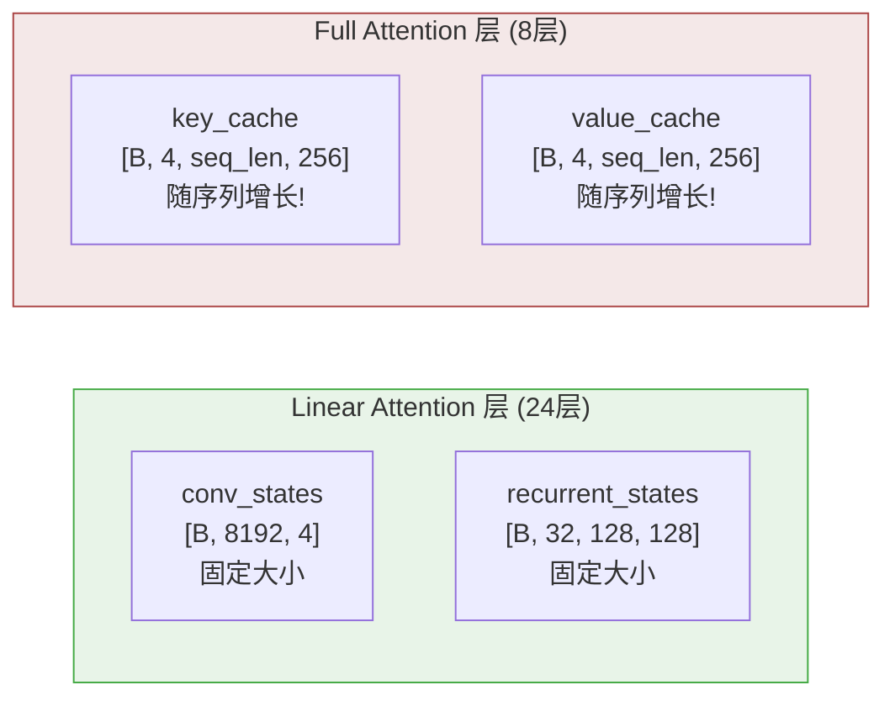

> 75% 的层使用恒定缓存 (Linear)，大幅降低长序列推理内存。当 L=32K 时，Full Attn cache ≈ B × 1 GB (随 L 增长)，Linear cache ≈ B × 25 MB (恒定)。

---

## 8. 位置编码: Interleaved MRoPE

多模态输入有 3 个维度的 position_ids: `[Temporal, Height, Width]`，每个维度分配一部分 RoPE 频率。默认 `mrope_section = [11, 11, 10]`，即 32 个频率中 11 给 T、11 给 H、10 给 W。

### 8.1 先理解标准 RoPE

RoPE 的核心思想: 把位置信息编码为**旋转角度**，对 query/key 向量的每一对维度做 2D 旋转。

以 head_dim=8 为例 (实际是 256，这里简化):

```
query 向量 q = [q₀, q₁, q₂, q₃, q₄, q₅, q₆, q₇]
                ─────  ─────  ─────  ─────
                pair 0  pair 1  pair 2  pair 3

每对维度用不同的旋转频率:
  θ₀ = 1/10000^(0/8) = 1.0        ← 高频, 旋转快
  θ₁ = 1/10000^(2/8) = 0.01       ← 中频
  θ₂ = 1/10000^(4/8) = 0.0001     ← 低频
  θ₃ = 1/10000^(6/8) = 0.000001   ← 极低频, 旋转慢
```

对于位置 pos=5 的 token，pair 0 的旋转:

```
角度 = θ₀ × pos = 1.0 × 5 = 5.0 弧度

旋转公式 (2D 旋转矩阵):
  q'₀ = q₀ × cos(5.0) - q₁ × sin(5.0)
  q'₁ = q₀ × sin(5.0) + q₁ × cos(5.0)

假设 q₀=1.0, q₁=0.0:
  q'₀ = 1.0 × 0.284 - 0.0 × (-0.959) = 0.284
  q'₁ = 1.0 × (-0.959) + 0.0 × 0.284 = -0.959
```

> 关键性质: 两个 token 的 q·k 点积只取决于它们的**位置差**，不取决于绝对位置。
> 这是因为旋转矩阵的性质: R(a)ᵀ · R(b) = R(b-a)。

### 8.2 MRoPE: 多维位置编码

标准 RoPE 只有一个位置 pos。但多模态输入有三个维度:

```
文本 token:  position_ids = [pos, pos, pos]     ← 三个维度相同 (退化为标准 RoPE)
图像 token:  position_ids = [t, h, w]           ← 时间帧、行、列 各不同
视频 token:  position_ids = [frame, row, col]   ← 三个维度都在变化
```

MRoPE 把 32 个频率分成 3 组，每组用不同维度的位置:

```
mrope_section = [11, 11, 10]

频率 0~10  (11个) → 用 Temporal 位置 t 计算旋转角度
频率 11~21 (11个) → 用 Height 位置 h 计算旋转角度
频率 22~31 (10个) → 用 Width 位置 w 计算旋转角度
```

具体例子 — 一张 4×4 图像的第 (2,3) 位置的 patch:

```
position_ids = [t=0, h=2, w=3]    ← 第 0 帧, 第 2 行, 第 3 列

频率 0 (Temporal 组): 角度 = θ₀ × t = θ₀ × 0 = 0        ← 不旋转 (静态图像 t=0)
频率 5 (Temporal 组): 角度 = θ₅ × t = θ₅ × 0 = 0        ← 不旋转
频率 11 (Height 组):  角度 = θ₁₁ × h = θ₁₁ × 2          ← 按行位置旋转
频率 15 (Height 组):  角度 = θ₁₅ × h = θ₁₅ × 2          ← 按行位置旋转
频率 22 (Width 组):   角度 = θ₂₂ × w = θ₂₂ × 3          ← 按列位置旋转
频率 28 (Width 组):   角度 = θ₂₈ × w = θ₂₈ × 3          ← 按列位置旋转
```

> 效果: 同一行不同列的 patch，Height 组的旋转角度相同，Width 组不同 → 模型能区分列位置。
> 同一列不同行的 patch，Width 组相同，Height 组不同 → 模型能区分行位置。

### 8.3 Interleaved vs Chunked

两种方式把 3 组频率映射到 head_dim 的维度上:

```
head_dim = 64 (旋转部分), 32 个频率, 每个频率占 2 维 (cos/sin pair)

Chunked (Qwen3-VL): 按组连续排列
  维度 [0:22]  → 频率 0~10  → 全部用 Temporal
  维度 [22:44] → 频率 11~21 → 全部用 Height
  维度 [44:64] → 频率 22~31 → 全部用 Width

  排列: [T T T T T T T T T T T | H H H H H H H H H H H | W W W W W W W W W W]

Interleaved (Qwen3.5): 按频率交错排列
  维度 [0:2]   → 频率 0  → Temporal   (因为 0 < 11)
  维度 [2:4]   → 频率 1  → Height     (交错!)
  维度 [4:6]   → 频率 2  → Width      (交错!)
  维度 [6:8]   → 频率 3  → Temporal
  维度 [8:10]  → 频率 4  → Height
  维度 [10:12] → 频率 5  → Width
  ...

  排列: [T H W T H W T H W T H W T H W T H W T H W T H W T H W T H W T H]
```

> 交错的好处: 不同维度的位置信息在频率空间中均匀分布，避免某一组集中在高频或低频。

### 8.4 Interleaved vs Chunked 图示

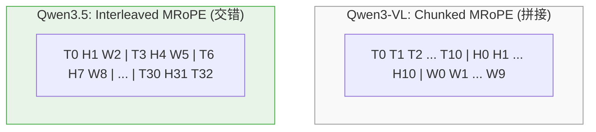

> 交错排列让不同维度的位置信息在频率空间中更均匀地分布。

### 8.5 partial_rotary_factor

默认 `partial_rotary_factor = 0.25`，head_dim=256 中只有 64 维参与 RoPE 旋转:

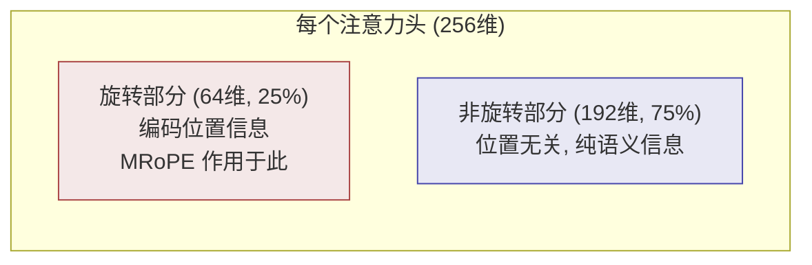

具体例子:

```
一个注意力头的 query 向量, 256 维:

q = [q₀, q₁, ..., q₆₃,  q₆₄, q₆₅, ..., q₂₅₅]
     ─────────────────    ──────────────────────
     旋转部分 (64维)        不旋转部分 (192维)
     MRoPE 在这里做         保持原样, 不编码位置
     2D 旋转

旋转部分的 64 维 = 32 个频率 × 2 维/频率:
  [pair₀, pair₁, ..., pair₃₁]
  每个 pair 用 MRoPE 的对应频率和位置做旋转
```

> 为什么只旋转 25%?
> - 256 维中 192 维不编码位置 → 这些维度专注于语义表示
> - 64 维编码位置 → 足够区分位置，同时不干扰语义
> - 对比: Qwen3-VL 的 head_dim=128, partial_rotary_factor=1.0 → 全部旋转

### 8.6 文本 vs 图像 的 position_ids 完整例子

假设输入序列: `[文本token×3, 图像patch×4 (2×2), 文本token×2]`

```
Token:     text₀  text₁  text₂  img(0,0)  img(0,1)  img(1,0)  img(1,1)  text₃  text₄
           ─────  ─────  ─────  ────────  ────────  ────────  ────────  ─────  ─────

Temporal:    0      1      2       3         3         3         3        4      5
Height:      0      1      2       3         3         4         4        5      6
Width:       0      1      2       3         4         3         4        5      6
```

> 文本 token: 三个维度的 position 相同 (退化为标准 1D RoPE)
> 图像 patch: Temporal 相同 (同一帧)，Height 按行变化，Width 按列变化
> 图像后的文本: 从图像的最大位置 +1 继续递增

```
img(0,0) 和 img(0,1) 的位置差:
  Temporal: 3-3=0  → Temporal 组的旋转角度差为 0 (同帧)
  Height:   3-3=0  → Height 组的旋转角度差为 0 (同行)
  Width:    4-3=1  → Width 组的旋转角度差 ≠ 0 (不同列!)
  → 模型通过 Width 组的频率区分同行不同列的 patch

img(0,0) 和 img(1,0) 的位置差:
  Temporal: 3-3=0  → 同帧
  Height:   4-3=1  → 不同行!
  Width:    3-3=0  → 同列
  → 模型通过 Height 组的频率区分同列不同行的 patch
```

---

## 9. 视觉编码器 (Qwen3_5VisionModel)

### 9.1 配置

| 参数 | 值 | 说明 |
|------|-----|------|
| `depth` | 27 | ViT 层数 |
| `hidden_size` | 1,152 | 视觉隐藏维度 |
| `intermediate_size` | 4,304 | 视觉 MLP 中间维度 |
| `num_heads` | 16 | 视觉注意力头数 |
| `patch_size` | 16 | Patch 大小 |
| `spatial_merge_size` | 2 | 空间合并因子 (2×2) |
| `temporal_patch_size` | 2 | 时间 Patch 大小 |
| `out_hidden_size` | 3,584 | 输出到 LLM 的维度 |

### 9.2 处理流程

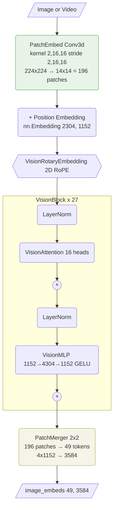

### 9.3 与 Qwen3-VL 的区别 (去除 DeepStack)

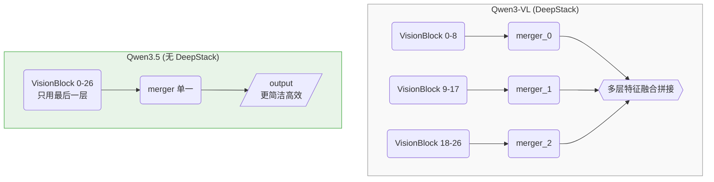


---

## 10. MLP 层

### SwiGLU MLP 内部结构

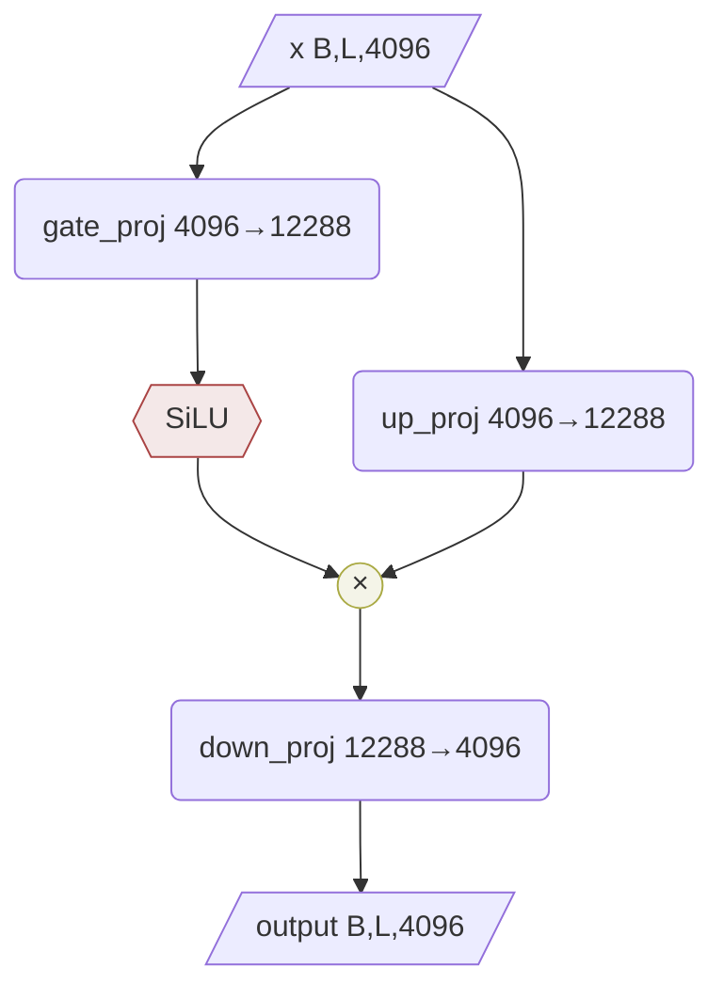

> 参数量 (每层): 3 × 4096 × 12288 ≈ 151M

---

## 11. RMSNorm 与 GatedRMSNorm

Qwen3.5 的 RMSNorm 有一个特殊设计 —— **1-centered**: weight 初始化为 0，公式为 `norm(x) × (1.0 + weight)`。初始时等价于恒等归一化，训练中 weight 围绕 0 波动，缩放因子围绕 1.0 波动，有利于训练稳定性。

### 11.1 BatchNorm vs LayerNorm vs RMSNorm

三者最本质的区别是**沿哪个维度归一化**:

```
输入张量形状: [B, L, D]   (batch, seq_len, hidden_dim)

BatchNorm:  沿 B 维度 — 对同一个特征, 统计所有样本的均值/方差
            每个特征 d: mean/var over all (b, l)
            训练时维护 running_mean/var, 推理时用固定统计量

LayerNorm:  沿 D 维度 — 对同一个 token, 统计所有特征的均值/方差
            每个 (b, l) 位置: mean/var over D

RMSNorm:   和 LayerNorm 一样沿 D 维度, 但省略减均值, 只除以 RMS
            每个 (b, l) 位置: RMS = sqrt(mean(x²)), 然后 x / RMS
```

数值例子 — 输入 `x = [3.0, -1.0, 2.0, 0.5]` (D=4):

```
LayerNorm:
  mean = (3 + (-1) + 2 + 0.5) / 4 = 1.125
  var  = mean((x - mean)²) = 2.172
  std  = 1.474
  norm = (x - mean) / std = [1.272, -1.441, 0.594, -0.424]
  out  = γ × norm + β

RMSNorm:
  RMS  = sqrt(mean(x²)) = sqrt((9+1+4+0.25)/4) = sqrt(3.5625) = 1.888
  norm = x / RMS = [1.589, -0.530, 1.060, 0.265]
  out  = (1 + weight) × norm                        ← 没有减均值, 没有偏移 β

BatchNorm (需要看同一个特征在 batch 内的分布):
  假设 batch 中特征 d=0 的值为 [3.0, 2.5, 3.2, 2.8, ...]
  mean_d0 = 2.875, var_d0 = 0.069, ...
  每个特征独立归一化
```

| | BatchNorm | LayerNorm | RMSNorm (Qwen3.5) |
|---|---|---|---|
| 归一化维度 | Batch 维 | Feature 维 | Feature 维 |
| 减均值 | ✓ | ✓ | ✗ |
| 除标准差/RMS | ✓ (σ) | ✓ (σ) | ✓ (RMS) |
| 可学习缩放 γ | ✓ | ✓ | ✓ (1+w) |
| 可学习偏移 β | ✓ | ✓ | ✗ |
| 依赖 batch 统计 | ✓ (running stats) | ✗ | ✗ |
| 训练/推理行为不同 | ✓ | ✗ | ✗ |
| 适合变长序列 | 差 | 好 | 好 |
| 计算量 | 中 | 中 | 少 (~省 10-15%) |

**为什么 LLM 都用 RMSNorm 而不用 BatchNorm:**

1. BatchNorm 依赖 batch 内统计量 → 推理时 batch_size=1 没法算，需要 running stats → 训练推理行为不一致
2. BatchNorm 对变长序列不友好 → 不同样本长度不同，padding 位置污染统计量
3. LayerNorm/RMSNorm 每个 token 独立归一化 → 不依赖 batch，训练推理一致，天然支持变长
4. RMSNorm 比 LayerNorm 更快 (省掉减均值)，实验表明效果几乎一样

### 11.2 LayerNorm vs RMSNorm 图示

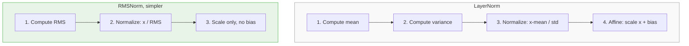

### 11.3 Qwen3.5 的 1-Centered RMSNorm

```python
class Qwen3_5RMSNorm(nn.Module):
    def __init__(self, dim, eps=1e-6):
        self.weight = nn.Parameter(torch.zeros(dim))  # ← 初始化为 0!

    def forward(self, x):
        output = self._norm(x.float())                     # x / RMS(x)
        output = output * (1.0 + self.weight.float())       # (1+w) 缩放
        return output.type_as(x)
```

```mermaid
graph LR
    subgraph STD["标准 RMSNorm (Llama)"]
        S1["weight 初始化为 1"]
        S2["output = norm(x) × weight"]
        S3["训练后 weight 可能偏离 1 很远"]
    end
    subgraph Q35N["Qwen3.5 RMSNorm (1-centered)"]
        Q1["weight 初始化为 0"]
        Q2["output = norm(x) × (1 + weight)"]
        Q3["训练后 weight 围绕 0 波动<br/>缩放因子围绕 1.0 波动, 更稳定"]
    end

    style STD fill:#f9f9f9,stroke:#999
    style Q35N fill:#e8f4e8,stroke:#4a4
```

### 11.4 数值例子: RMSNorm 计算过程

输入: `x = [3.0, -1.0, 2.0, 0.5]` (d=4), `weight = [0.1, -0.2, 0.0, 0.3]`

1. variance = (9 + 1 + 4 + 0.25) / 4 = 3.5625
2. rsqrt(3.5625) = 0.5298
3. x_norm = [1.589, -0.530, 1.060, 0.265]
4. scale = 1 + weight = [1.1, 0.8, 1.0, 1.3]
5. output = [1.748, -0.424, 1.060, 0.344]

### 11.5 GatedRMSNorm (Qwen3_5RMSNormGated)

GatedRMSNorm 是 RMSNorm 的扩展，额外接收一个 gate 信号 z:

```mermaid
graph TD
    CAO2[/"core_attn_out<br/>Delta Rule output"/] --> NORM2("RMSNorm<br/>normalize then scale by weight")
    Z2[/"z from in_proj_z<br/>not through Conv1d"/] --> SILU3{{"SiLU: z × sigmoid z"}}
    NORM2 --> MUL4(("×"))
    SILU3 --> MUL4
    MUL4 --> GOUT2[/"gated_output"/]

    style NORM2 fill:#e8e8f4,stroke:#44a
    style SILU3 fill:#f4e8e8,stroke:#a44
    style MUL4 fill:#f4f4e8,stroke:#aa4
```

```python
class Qwen3_5RMSNormGated(nn.Module):
    def __init__(self, hidden_size, eps=1e-6):
        self.weight = nn.Parameter(torch.ones(hidden_size))  # ← 初始化为 1 (不是 0!)

    def forward(self, hidden_states, gate=None):
        # Step 1: RMSNorm
        variance = hidden_states.pow(2).mean(-1, keepdim=True)
        hidden_states = hidden_states * torch.rsqrt(variance + self.variance_epsilon)
        hidden_states = self.weight * hidden_states
        # Step 2: Gate
        hidden_states = hidden_states * F.silu(gate)
        return hidden_states
```

> 注意: GatedRMSNorm 的 weight 初始化为 **1** (标准 RMSNorm)，不是 0 (1-centered)。两者不同。

### 11.5 SiLU 激活函数

`SiLU(x) = x × sigmoid(x)`，也叫 Swish:

| x | sigmoid(x) | SiLU(x) | 效果 |
|---|-----------|---------|------|
| -5 | 0.007 | -0.03 | 几乎为 0，信号被抑制 |
| -2 | 0.119 | -0.24 | 大幅抑制 |
| 0 | 0.5 | 0 | 完全关闭 |
| +2 | 0.881 | 1.76 | 大部分通过 |
| +5 | 0.993 | 4.97 | 几乎等于 x，完全通过 |

### 11.6 GatedRMSNorm 数值例子

输入: `out = [2.0, -1.0, 0.5, 3.0]`, `z = [1.5, -2.0, 0.0, 4.0]`, `weight = [1,1,1,1]`

1. RMSNorm: normed = [1.060, -0.530, 0.265, 1.589]
2. SiLU(z) = [1.228, -0.238, 0.000, 3.928]
3. output = normed × SiLU(z) = [1.302, 0.126, 0.000, 6.242]

观察:
- 维度 0: z=1.5 (正) → 信号放大通过
- 维度 1: z=-2.0 (负) → 信号被抑制并翻转
- 维度 2: z=0.0 → **信号完全关闭** (gate 关闭!)
- 维度 3: z=4.0 (很正) → 信号大幅放大

### 11.7 为什么 GatedDeltaNet 需要 GatedRMSNorm?

```mermaid
graph TD
    REASON1["1. 状态矩阵 S 递推累积<br/>→ 输出数值范围不稳定<br/>→ RMSNorm 归一化到稳定范围"]
    REASON2["2. 不是所有维度都有用<br/>→ z gate 选择性关闭无用维度<br/>→ 类似 LSTM 的输出门"]
    REASON3["3. z 不经过 Conv1d<br/>→ gate 只基于当前 token 语义<br/>→ Delta Rule 输出融合了历史<br/>→ 结合 = 用当前语义筛选历史信息"]

    style REASON1 fill:#f4e8e8,stroke:#a44
    style REASON2 fill:#f4f4e8,stroke:#aa4
    style REASON3 fill:#e8f4e8,stroke:#4a4
```

> 类比: Delta Rule 输出 = 从图书馆检索到的一堆资料；z gate = 你的判断力，决定哪些有用；RMSNorm = 整理成统一格式；GatedRMSNorm = 整理 + 筛选。

### 11.8 三种归一化完整对比

| | nn.LayerNorm (Vision) | Qwen3_5RMSNorm (Text) | Qwen3_5RMSNormGated (DeltaNet) |
|---|---|---|---|
| 减均值 | ✓ | ✗ | ✗ |
| 除以 RMS/σ | ✓ (用 σ) | ✓ (用 RMS) | ✓ (用 RMS) |
| 缩放 γ | ✓ | ✓ (1+weight) | ✓ (weight) |
| 偏移 β | ✓ | ✗ | ✗ |
| 门控 gate | ✗ | ✗ | ✓ SiLU(z) |
| weight 初始化 | 1 | **0** (1-centered) | **1** (标准) |
| 输入个数 | 1 | 1 | 2 (x + gate) |
| 使用位置 | ViT Block | DecoderLayer 前后 + QK norm | GatedDeltaNet 输出 |
| 计算公式 | γ(x-μ)/σ + β | (1+w)·x/RMS | w·x/RMS·SiLU(z) |

---

## 12. MoE 变体 (Qwen3.5-MoE)

### 12.1 MoE 配置 (35B-A3B-Instruct)

| 参数 | 值 | 说明 |
|------|-----|------|
| `hidden_size` | 2,048 | 隐藏维度 (比 Dense 小) |
| `num_hidden_layers` | 40 | 层数 (比 Dense 多) |
| `num_attention_heads` | 16 | 注意力头数 |
| `num_key_value_heads` | 2 | KV 头数 (8:1 GQA) |
| `num_experts` | 256 | 专家总数 |
| `num_experts_per_tok` | 8 | 每 token 激活专家数 |
| `moe_intermediate_size` | 512 | 路由专家中间维度 |
| `shared_expert_intermediate_size` | 512 | 共享专家中间维度 |

### 12.2 MoE DecoderLayer 内部结构

```mermaid
graph TD
    HM[/"hidden_states B,L,2048"/] --> LNM("input_layernorm")
    HM --> RESM1(("+"))
    LNM --> TM("Token Mixer<br/>GatedDeltaNet or Gated Attention")
    TM --> RESM1
    RESM1 --> MIDM[/"mid hidden"/]
    MIDM --> LNM2("post_attention_layernorm")
    MIDM --> RESM2(("+"))

    LNM2 --> ROUTER

    subgraph MOE["SparseMoeBlock"]
        ROUTER("TopKRouter<br/>gate 2048→256<br/>softmax, top-8")
        EXPERTS("Experts x256<br/>only top-8 activated")
        SHARED("SharedExpert<br/>always active")
        ROUTER --> EXPERTS
        EXPERTS --> MOEADD(("+"))
        SHARED --> MOEADD
    end

    MOEADD --> RESM2
    RESM2 --> OUTM[/"output B,L,2048"/]

    style MOE fill:#f4f4e8,stroke:#aa4
    style ROUTER fill:#f4e8e8,stroke:#a44
```

> 总参数 35B，每 token 激活约 3B 参数 (A3B)。

---

## 13. 多模态融合 (Qwen3_5Model)

### 13.1 融合流程图

```mermaid
graph TD
    subgraph STEP1["Step 1: Text Embedding"]
        IDS2[/"input_ids with image placeholders"/] --> EMB2("embed_tokens")
        EMB2 --> EMBOUT[/"inputs_embeds with placeholder embeddings"/]
    end

    subgraph STEP2["Step 2: Vision Encoding"]
        PV[/"pixel_values"/] --> VMODEL("VisionModel")
        VMODEL --> IEMB[/"image_embeds 49, 3584"/]
    end

    subgraph STEP3["Step 3: Fusion via masked_scatter"]
        EMBOUT --> MS{{"masked_scatter"}}
        IEMB --> MS
        MS --> FUSED[/"fused embeds: text + vision tokens"/]
    end

    subgraph STEP4["Step 4: 3D Position Encoding"]
        FUSED --> ROPE3{{"get_rope_index"}}
        ROPE3 --> POSIDS[/"position_ids 3,B,L<br/>Temporal / Height / Width"/]
    end

    FUSED --> TM2("Qwen3_5TextModel")
    POSIDS --> TM2
    TM2 --> HOUT[/"hidden_states B,L,4096"/]

    style STEP3 fill:#f4f4e8,stroke:#aa4
    style STEP4 fill:#e8f4e8,stroke:#4a4
```

### 13.2 完整数值例子

假设用户发送: `"描述这张图片 <image> 的内容"`，图片为 224×224。

#### Step 1: Tokenize + Text Embedding

Tokenizer 把文本转成 token，图片位置插入特殊占位符:

```
原始输入:  "描述这张图片 <image> 的内容"

Tokenizer 输出 input_ids:
  [描述, 这张, 图片, , , ..., , 的, 内容]
                     ──────────────────────────
                     49 个  占位 token
                     (224/16=14, 14/2=7, 7×7=49 个 patch)

input_ids = [1001, 1002, 1003, 151655, 151655, ..., 151655, 1004, 1005]
                                ──────────────────────────────
                                49 个 151655 (IMAGE_TOKEN_ID)
总长度 L = 3 + 49 + 2 = 54
```

embed_tokens 把每个 token_id 查表得到 4096 维向量:

```
inputs_embeds 形状: [1, 54, 4096]

  位置 0: embed("描述")  = [0.12, -0.34, ..., 0.56]   ← 文本 embedding
  位置 1: embed("这张")  = [0.23, 0.45, ..., -0.12]
  位置 2: embed("图片")  = [-0.11, 0.67, ..., 0.33]
  位置 3: embed()   = [0.01, 0.01, ..., 0.01]    ← 占位符 embedding (无意义)
  位置 4: embed()   = [0.01, 0.01, ..., 0.01]    ← 同上, 稍后会被替换!
  ...
  位置 51: embed()  = [0.01, 0.01, ..., 0.01]
  位置 52: embed("的")   = [0.44, -0.22, ..., 0.11]
  位置 53: embed("内容") = [-0.33, 0.55, ..., 0.77]
```

#### Step 2: Vision Encoding

VisionModel 独立处理图片:

```
pixel_values: [1, 3, 224, 224]   ← 1张图, RGB, 224×224

PatchEmbed (Conv3d):
  kernel = (2, 16, 16), stride = (2, 16, 16)
  224 / 16 = 14 → 14×14 = 196 个 patch
  每个 patch → 1152 维向量
  输出: [196, 1152]

+ Position Embedding + 2D RoPE
  ↓
27 层 VisionBlock (LayerNorm → Attention → +残差 → LayerNorm → MLP → +残差)
  输出: [196, 1152]

PatchMerger (2×2 合并):
  每 2×2 = 4 个相邻 patch 合并为 1 个 token
  14/2 = 7 → 7×7 = 49 个 token
  4 × 1152 = 4608 → 线性投影到 3584
  输出: [49, 3584]
```

但 LLM 的 hidden_size 是 4096，不是 3584? 这里 3584 维的 image_embeds 会在 `masked_scatter` 时被投影到 4096 维 (通过一个额外的线性层)，或者模型配置中 `out_hidden_size` 直接匹配 LLM 的 hidden_size。在 9B 模型中 `out_hidden_size = 3584`，而 `hidden_size = 3584` (不是 4096)。

> 注: 上面的 4096 是简化说明。实际 9B 模型的 hidden_size = 3584，MoE 35B 模型的 hidden_size = 2048。

#### Step 3: masked_scatter 融合

这是最关键的一步 — 把 VisionModel 输出的图像 embedding 替换到文本 embedding 序列中:

```
# 1. 找到所有  占位符的位置
image_mask = (input_ids == IMAGE_TOKEN_ID)
  = [F, F, F, T, T, T, ..., T, F, F]
              ─────────────────
              位置 3~51 为 True (49个)

# 2. 用 masked_scatter 替换
inputs_embeds.masked_scatter_(image_mask, image_embeds)
```

masked_scatter 的工作方式:

```
替换前:
  位置 0: [文本 "描述"]     ← 保留
  位置 1: [文本 "这张"]     ← 保留
  位置 2: [文本 "图片"]     ← 保留
  位置 3: [占位符 0.01...]  ← mask=True, 替换!
  位置 4: [占位符 0.01...]  ← mask=True, 替换!
  ...
  位置 51: [占位符 0.01...] ← mask=True, 替换!
  位置 52: [文本 "的"]      ← 保留
  位置 53: [文本 "内容"]    ← 保留

替换后:
  位置 0: [文本 "描述"]                          ← 不变
  位置 1: [文本 "这张"]                          ← 不变
  位置 2: [文本 "图片"]                          ← 不变
  位置 3: [图像 patch(0,0) 的 3584 维向量]       ← 来自 VisionModel!
  位置 4: [图像 patch(0,1) 的 3584 维向量]       ← 来自 VisionModel!
  ...
  位置 51: [图像 patch(6,6) 的 3584 维向量]      ← 来自 VisionModel!
  位置 52: [文本 "的"]                           ← 不变
  位置 53: [文本 "内容"]                         ← 不变
```

> 融合后的序列: 文本和图像 token 在同一个序列中，维度相同，可以直接送入 TextModel。
> 图像 token 携带了 VisionModel 提取的视觉语义，文本 token 携带了词表 embedding 的语义。

#### Step 4: 生成 3D position_ids

`get_rope_index` 为融合后的序列生成三维位置编码:

```
position_ids 形状: [3, 1, 54]   ← 3 个维度 × batch × seq_len

                 位置: 0  1  2  3  4  5  6  ... 9  10 ... 51 52 53
                       描 这 图 (0,0)(0,1)(0,2)(0,3)...(0,6)(1,0)...(6,6) 的 内

Temporal (时间):   0  1  2   3   3   3   3  ...  3   3  ...  3  4  5
Height (行):       0  1  2   3   3   3   3  ...  3   4  ...  9  10 11
Width (列):        0  1  2   3   4   5   6  ...  9   3  ...  9  10 11
```

规则:
- 文本 token: 三个维度相同，递增 (退化为 1D RoPE)
- 图像 token: Temporal 相同 (同一帧)，Height 按行变化，Width 按列变化
- 图像后的文本: 从图像区域的最大位置 +1 继续

```
图像区域 7×7 的 position_ids 详细展开:

patch 位置    Temporal  Height  Width
(0,0)           3        3       3
(0,1)           3        3       4
(0,2)           3        3       5
...
(0,6)           3        3       9
(1,0)           3        4       3      ← 换行: Height+1, Width 回到 3
(1,1)           3        4       4
...
(6,6)           3        9       9
```

#### Step 5: 送入 TextModel

```
TextModel 的输入:
  inputs_embeds: [1, 54, 3584]    ← 文本+图像混合序列
  position_ids:  [3, 1, 54]       ← 三维位置编码

TextModel 内部:
  32 层 DecoderLayer (24层 GatedDeltaNet + 8层 Full Attention)
  Full Attention 层使用 position_ids 做 MRoPE
  GatedDeltaNet 层不使用位置编码 (因果性由递推保证)

输出:
  hidden_states: [1, 54, 3584]
  → lm_head → logits: [1, 54, 248320]
  → 取最后一个 token 的 logits → softmax → 生成下一个 token
```

#### 为什么用 masked_scatter 而不是 concat?

```
方案 A (concat): [文本 tokens] + [图像 tokens] + [文本 tokens]
  问题: 图像 tokens 的位置固定在中间，不灵活
  问题: 多张图片时需要复杂的拼接逻辑

方案 B (masked_scatter, Qwen3.5 的做法):
  1. Tokenizer 在图片位置插入 N 个  占位符
  2. embed_tokens 给占位符一个临时 embedding
  3. masked_scatter 用 VisionModel 的输出替换占位符
  优点: 图片可以出现在序列的任意位置
  优点: 多张图片自然支持 (每张图各自的占位符区域)
  优点: 文本和图像的位置关系由 tokenizer 决定，模型不需要特殊处理
```

---

## 14. 参数量估算 (9B Dense)

| 组件 | 参数量 | 说明 |
|------|--------|------|
| embed_tokens | ~1.0B | 248320 × 4096 |
| Full Attention × 8 | ~1.1B | 每层: q(4096×8192) + k(4096×1024) + v(4096×1024) + o(4096×4096) |
| GatedDeltaNet × 24 | ~1.4B | 每层: qkv(4096×8192) + z(4096×4096) + b,a(4096×32×2) + conv + out |
| MLP × 32 | ~4.8B | 每层: gate(4096×12288) + up(4096×12288) + down(12288×4096) |
| VisionModel | ~0.4B | 27层 ViT |
| lm_head | ~1.0B | 4096 × 248320 |
| **总计** | **~9.7B** | |

---

## 15. 关键设计总结

| 设计选择 | Qwen3-VL | Qwen3.5 | 意义 |
|----------|----------|---------|------|
| 注意力机制 | 纯 Softmax | 混合 (Softmax + GatedDeltaNet) | 降低长序列推理成本 |
| Attention Gate | 无 | sigmoid gate on output | 更灵活的信息流控制 |
| 位置编码 | Chunked MRoPE | Interleaved MRoPE | 更均匀的位置信息分布 |
| DeepStack | 有 | 移除 | 简化视觉特征提取 |
| RMSNorm | 标准 | 1-centered (初始化为0) | 训练稳定性 |
| partial_rotary_factor | 1.0 | 0.25 | 大部分维度位置无关 |
| head_dim | 128 | 256 | 更大的注意力头维度 |

---

## 16. 文件索引

```
docs/qwen3_5_arch/
├── modular_qwen3_5.py          # 核心源文件 (841行), 定义所有新增/修改的类
├── modular_qwen3_5_moe.py      # MoE 变体源文件 (464行)
├── modeling_qwen3_5.py          # 自动生成的完整模型 (2194行)
├── modeling_qwen3_5_moe.py      # 自动生成的 MoE 模型 (2414行)
├── configuration_qwen3_5.py     # 配置类 (307行)
├── configuration_qwen3_5_moe.py # MoE 配置类 (330行)
├── qwen3_5.md                   # HuggingFace 文档
├── qwen3_5_moe.md               # MoE 文档
└── pr_files.json                # PR 变更记录
```

